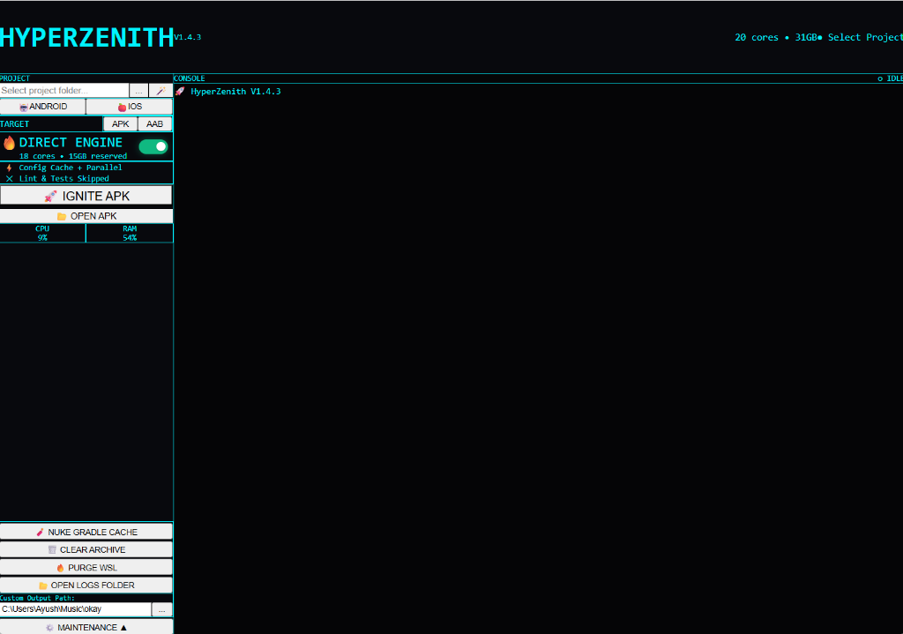
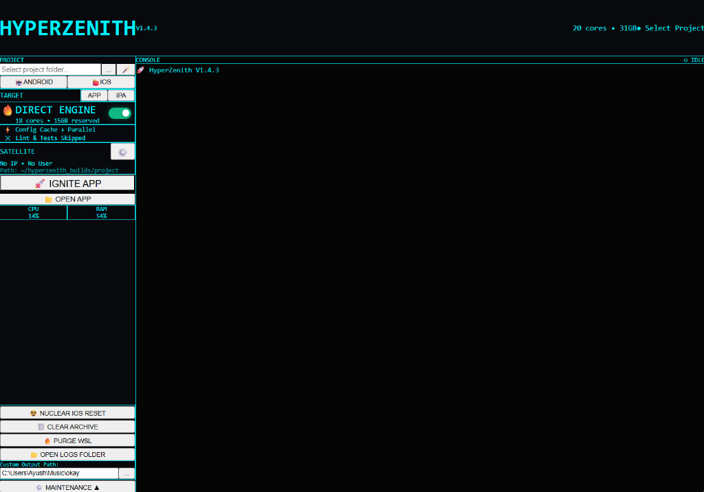

# HyperZenith 🏎️
> **The Cross-Platform Build Orchestrator for React Native & Expo.**

A sleek Tauri desktop app that supercharges your local Android builds and remote-controls your Mac for high-speed iOS builds. HyperZenith manages the "compilation chaos" so you don't have to.


## 🖥️ Screenshots




## ✨ Features

### 🤖 Android: Direct Engine
- **Hardware Auto-Detection** – Scans your CPU cores & RAM to allocate ~90% of resources for builds.
- **Direct Gradle Injection** – Bypasses Expo CLI overhead by invoking `./gradlew` directly in WSL.
- **Turbo Config** – One-click optimized flags (`--parallel`, `--build-cache`, `-Dkotlin.incremental=true`).
- **Smart Caching** – Detects if you're rebuilding the same code or if a fresh build is needed.

### 🍎 iOS: Satellite Mode (Experimental)
> **Build iOS apps from Windows via a remote Mac.**
- **Headless Remote Control** – No VNC/TeamViewer lag. Send build commands over SSH.
- **Auto-Sync** – Mirrors your local Windows project to the Mac via `rsync` before every build.
- **Turbo Xcode** – Runs `xcodebuild` with stripped variables (no indexing, no UI) for maximum speed.
- **MacinCloud Ready** – Supports custom SSH ports (IP:PORT) and auto-bypasses strict host checking.

### ☢️ Nuclear Recovery Tools
> **"Have you tried turning it off and on again?" — but for compilers.**
- **Nuke Gradle Cache** – Force-clears `android/app/build` and corrupted Gradle daemons.
- **Nuke iOS (Remote)** – Automates the "Xcode is cursed" ritual: kills processes, purges `DerivedData`, wipes Simulators, clears CocoaPods, and re-installs Pods.
- **WSL Purge** – Instantly reclaims memory from `VmmemWSL`.

### 📦 APK & IPA Management
- **Artifact Archive** – All builds (APK, AAB, APP, IPA) are saved to `hyperzenith_builds/` with timestamps.
- **One-Click Install** – Open the output folder instantly.
- **Logs** – Diagnostic logs for every build failure saved in `hyperzenith_logs/`.

## 🚀 Getting Started

### Prerequisites
- **Windows 10/11** with WSL2 active.
- **Node.js 18+** installed in WSL.
- **Rust** (via rustup) on Windows.
- **For iOS**: A Mac/MacinCloud accessible via SSH.

### Installation

```bash
# Clone the repo
git clone https://github.com/MrHickaru/hyperzenith.git
cd hyperzenith

# Install dependencies
npm install

# Run in dev mode
npm run tauri dev

# Build for production
npm run tauri build
```

## ⚡ How It Works

### Android Strategy
HyperZenith ignores the standard `npx expo run:android` and instead constructs a highly optimized Gradle command:

```bash
./gradlew assembleDebug \
  --parallel \
  --build-cache \
  --max-workers=18 \
  -Dorg.gradle.caching=true \
  -Dorg.gradle.parallel=true \
  -Dkotlin.incremental=true \
  -x lint -x test
```

### iOS Strategy
1.  **Sync**: `rsync` pushes only changed files to `user@mac:~/builds/project`.
2.  **Build**: `ssh` triggers `xcodebuild` with `COMPILER_INDEX_STORE_ENABLE=NO` and `RCT_NO_LAUNCH_PACKAGER=1`.
3.  **Result**: You see the real-time logs on Windows.

## 🛠️ Tech Stack

- **Frontend**: React + TypeScript + TailwindCSS
- **Backend**: Rust + Tauri
- **Protocol**: SSH2 + Rsync

## 📄 License

MIT © 2026 MrHickaru

---

**Made with ⚡ by developers who got tired of waiting for builds.**
