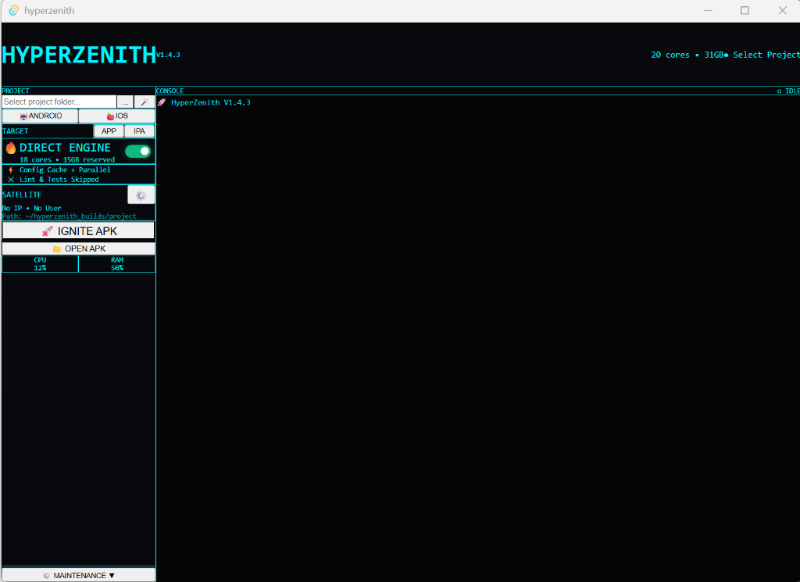

# HyperZenith 🏎️
> **Speed up and manage your local Android builds for Expo & React Native.**

A sleek Tauri + React desktop app that supercharges your local Android builds by automatically detecting your hardware and configuring Gradle for maximum parallelism.


## 🖥️ Screenshot



## ✨ Features

### Build Performance
- **Auto-Detect Hardware** – Detects CPU cores & RAM, allocates ~90% for builds
- **Turbo Mode** – One-click optimized Gradle flags (`--parallel`, `--build-cache`, `-Dkotlin.incremental=true`)
- **Live Build Timer** – Real-time MM:SS elapsed time tracking
- **Fresh vs Cached Detection** – Know instantly if your APK was rebuilt or reused

### APK Management
- **AAB & APK Support** – Toggle between debug APKs and store-ready AAB bundles
- **Managed Archive** – All builds saved to `hyperzenith_builds/` with timestamps
- **Custom Output Path** – Set your own APK/AAB destination folder (persisted)
- **Open APK Folder** – One-click access to your archived builds
- **Clear Archive** – Quickly delete old APKs and AABs

### Maintenance Tools
- **Nuke Gradle Cache** – Force-clear corrupted build directories (`android/app/build`, `.gradle`)
- **WSL Purge** – Instantly reclaim memory from `VmmemWSL`
- **Diagnostic Logging** – Timestamped failure logs in `hyperzenith_logs/`

### UI/UX
- **Sleek Cyberpunk Design** – Dark theme with neon accents
- **Live CPU/RAM Stats** – Real-time system monitoring
- **Project Auto-Detection** – Scans common directories for React Native/Expo projects
- **Silent Production Builds** – No more popping terminal windows in release mode
- **Turbo Toggle** – Precise, tactile toggle switch

## 🚀 Getting Started

### Prerequisites
- Windows 10/11 with WSL2
- Node.js 18+
- Rust (via rustup)
- Android SDK (via Android Studio)

### Installation

```bash
# Clone the repo
git clone https://github.com/MrHickaru/hyperzenith.git
cd hyperzenith

# Install dependencies
npm install

# Run in dev mode
npm run tauri dev

# Build for production
npm run tauri build
```

## ⚡ How It Works

When you click **IGNITE BUILD**, HyperZenith runs this optimized Gradle command inside WSL:

```bash
./gradlew assembleDebug \
  --parallel \
  --build-cache \
  --max-workers=18 \
  -Dorg.gradle.caching=true \
  -Dorg.gradle.parallel=true \
  -Dorg.gradle.vfs.watch=true \
  -Dkotlin.incremental=true \
  -x lint -x test
```

The `--max-workers` and JVM heap are auto-calculated from your system specs.

## 🛠️ Tech Stack

- **Frontend**: React + TypeScript + TailwindCSS
- **Backend**: Rust + Tauri
- **Build Target**: WSL2 + Gradle

## 📄 License

MIT © 2026 MrHickaru

---

**Made with ⚡ by developers who got tired of waiting for builds.**
